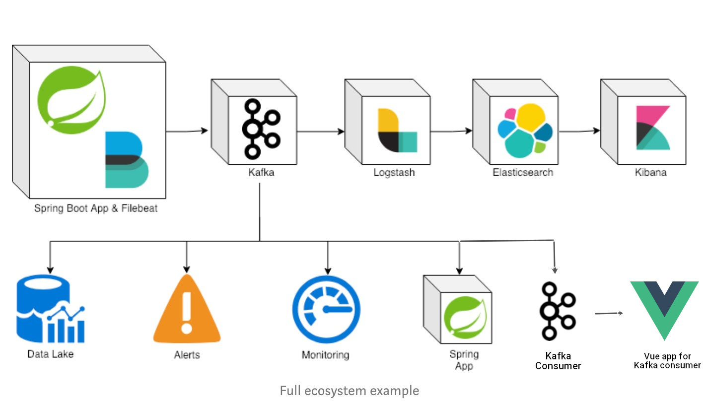
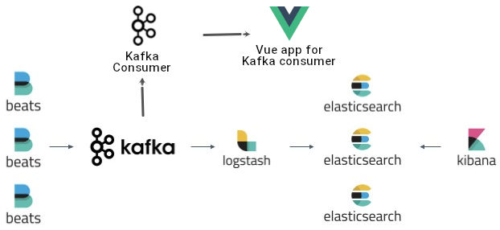
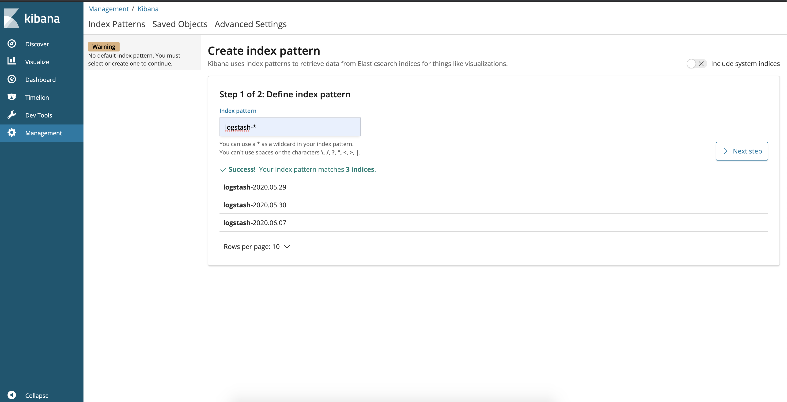
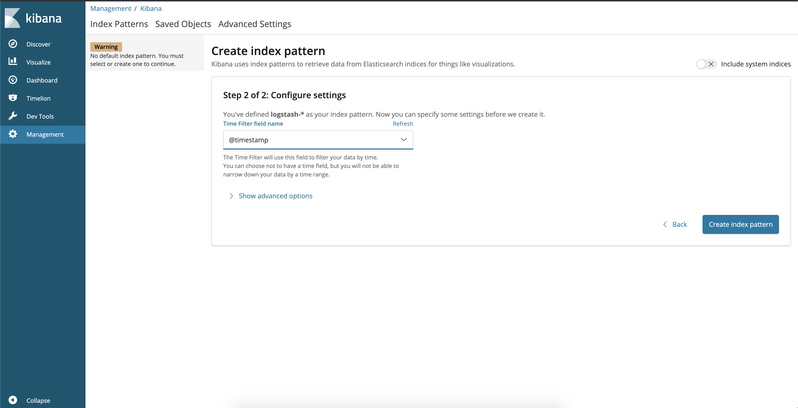
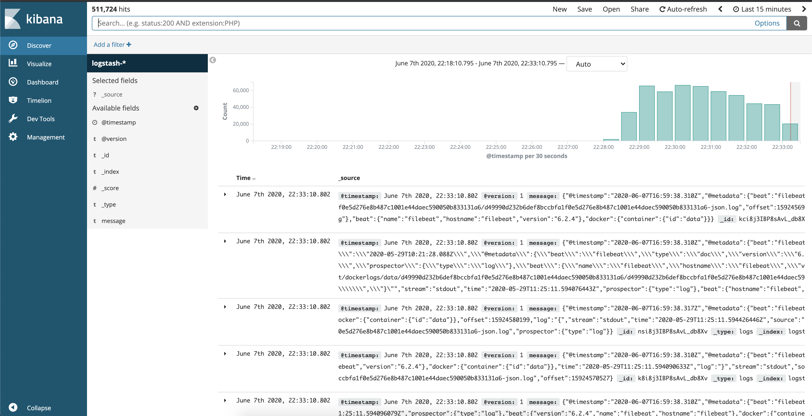
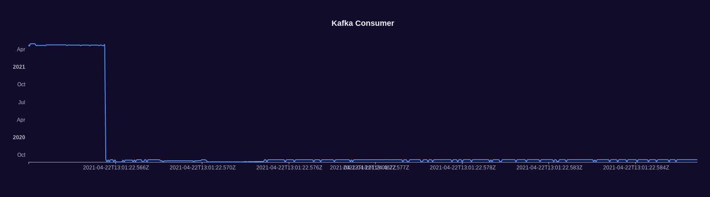

# T3.5 Data collection and visualisation toolkit

---

This repository contains a working dockerised setup for Task 3.5 of SPIDER H2020 project concerning the data collection and visualisation toolkit. The goal of this repository is to demonstrate a centralised logging collection mechanism based on spring boot applications.

SPIDER components that need to send their data to the visualisation dashboard need to provide their kafka topics and the payload schema.

The "final" vue-based sample dashboard includes a "STREAM" button that emulates the data streaming from any SPIDER component and its near real time visualisation in the dashboard.

## TL;DR

Just [check out a quick video](https://www.youtube.com/watch?v=UJCPYIxsWnc) of the overall process

## Technologies used

---

- ElasticSearch
- Logstash
- Kibana
- Kafka
- Filebeat
- Spring Boot

> Initially this stack was based on [this](https://github.com/AbhiJD9602/elkk) repo and was customised to SPIDER's requirements

## Project Architecture

---



## Applications

---

- **application**

`Spring Boot` Web Java application that generates logs and pushes logs events to `log_stream` topic in `Kafka` using `Filebeat`.



## Start Environment

---

> **Important:**
> The `vm_max_map_count` kernel setting needs to be set to at least `262144` for production use. More details [here](https://www.elastic.co/guide/en/elasticsearch/reference/current/docker.html#docker-prod-prerequisites).

- Open a terminal and inside `elkk` root folder run

```text
docker-compose up -d
```

- Wait a until all containers are Up (healthy). You can check their status by running

```text
docker-compose ps
```

## Running Applications with Gradle

---

Inside `elkk` root folder, run the following `Gradle` commands in different terminals

- _application_

```text
./gradlew :application:bootRun
```

## Running Applications as Docker containers

---

#### Build Application's Docker Image

- In a terminal, make sure you are in `elkk` root folder
- In order to build the applications docker images, run the following script

```text
./build-apps.sh
```

#### Application's Environment Variables

| Environment Variable | Description                                                                          |
| -------------------- | ------------------------------------------------------------------------------------ |
| `ZIPKIN_HOST`        | Specify host of the `Zipkin` distributed tracing system to use (default `localhost`) |
| `ZIPKIN_PORT`        | Specify port of the `Zipkin` distributed tracing system to use (default `9411`)      |

#### Start Application's Docker Container

- In a terminal, make sure you are inside `elkk` root folder
- Run following script

```text
./start-apps.sh
```

## Configuring Kafka

---

**Kafka Manager**
`Kafka Manager` can be accessed at [http://localhost:9000](http://localhost:9000)

- First, you must create a new cluster. Click on `Cluster` (dropdown button on the header) and then on `Add Cluster`
- Type the name of your cluster in `Cluster Name` field, for example: `MyZooCluster`
- Type `zookeeper:2181` in `Cluster Zookeeper Hosts` field
- Enable checkbox `Poll consumer information (Not recommended for large # of consumers if ZK is used for offsets tracking on older Kafka versions)`
- Click on `Save` button at the bottom of the page.

## Configuring Kibana

---

- You can then access kibana in your web browser: (http://localhost:5601).
- The first thing you have to do is to configure the ElasticSearch indices that can be displayed in Kibana.



- You can use the pattern logstash-\* to include all the logs coming from FileBeat via Kafka.
- You also need to define the field used as the log timestamp. You should use @timestamp as shown below:



- And you are done. You can now visualize the logs generated by FileBeat, ElasticSearch, Kibana and your other containers in the Kibana interface:



## Kafka consumer

---

- The `Kafka consumer` is running on the backend and on port 3000.
- The `Vue web application` that shows visualizations based on `Kafka consumer` data can be accessed at [http://localhost:8080](http://localhost:8080).

Visualizations are based on `Vue-ECharts`, a Vue.js component for `Apache ECharts`. More details [here](https://github.com/ecomfe/vue-echarts).



## Shutdown

---

- Stop applications
  - If they were started with `Gradle`, go to the terminals where they are running and press `Ctrl+C`
  - If they were started as a Docker container, run the script below

```text
./stop-apps.sh
```

- Stop and remove docker-compose containers, networks and volumes

```text
docker-compose down -v
```

## Useful links

---

- **Kafka Topics UI**
  `Kafka Topics UI` can be accessed at [http://localhost:8085](http://localhost:8085)

- **Zipkin**
  `Zipkin` can be accessed at [http://localhost:9411](http://localhost:9411)

- **Elasticsearch REST API**
  Check ES is up and running

  ```
    	curl http://localhost:9200
  ```

  Check indexes in ES

  ```
    	curl http://localhost:9200/_cat/indices?v
  ```

  Check _news_ index mapping

  ```
    	curl http://localhost:9200/news/_mapping
  ```

  Simple search

  ```
    	curl http://localhost:9200/news/news/_search
  ```
